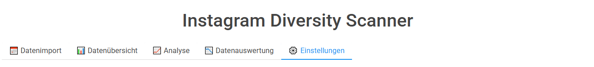
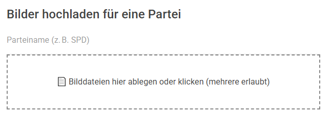
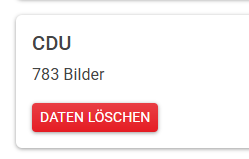
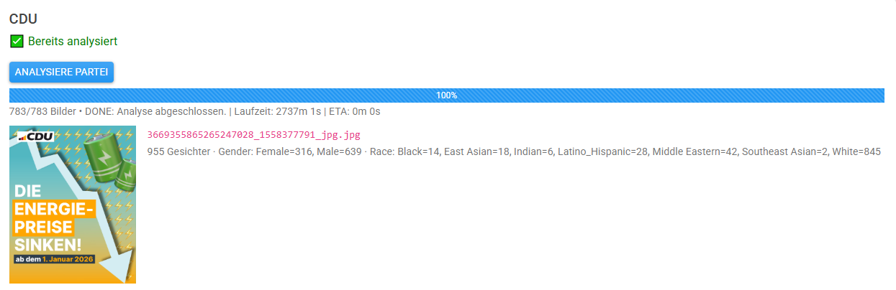
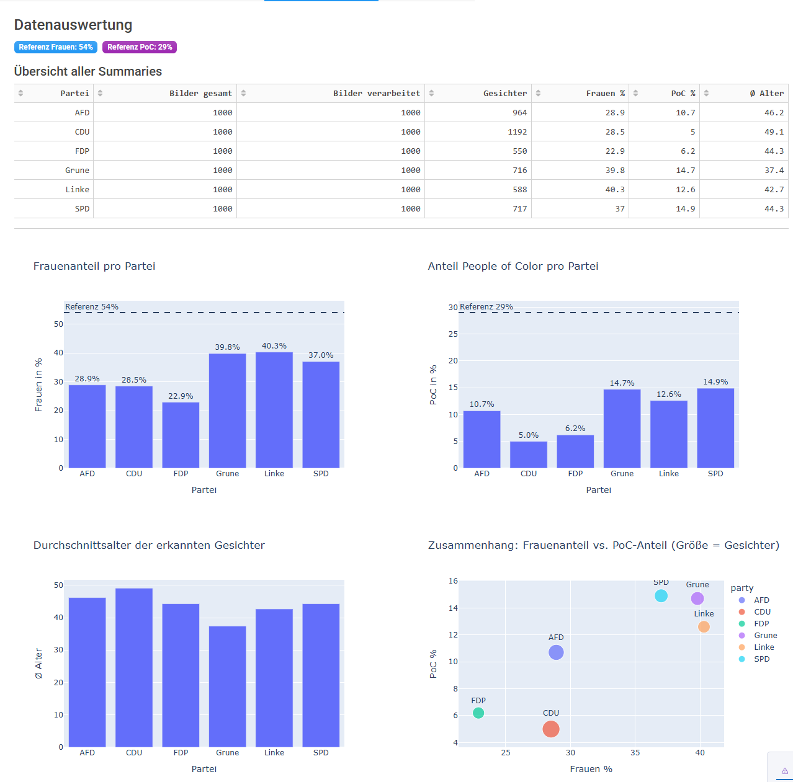
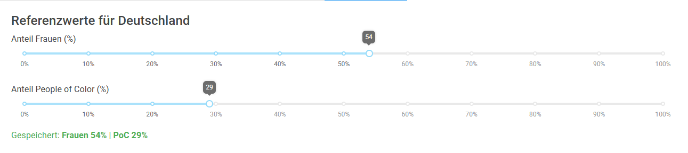

# Instagram Diversity Scanner  
_Eine Dash-App zur Analyse der Sichtbarkeit von Diversität auf Instagram-Profilen deutscher Parteien_  
**Autor:** Oliver Stech

---

## Überblick

**Ziel** des Projekts ist es, zu prüfen, wie Parteien auf Instagram **Geschlecht** und **Hauttypen** in ihren Bildwelten sichtbar machen. Die App bietet einen **End-to-End-Workflow**: Bilder hochladen → Analyse starten → Fortschritt live verfolgen → Ergebnisse als Tabellen & Diagramme auswerten.

Die Oberfläche ist als **Dash**-Anwendung umgesetzt und in **Tabs** organisiert: *Datenimport, Datenübersicht, Analyse, Datenauswertung, Einstellungen* 

**Tech-Stack:** Dash, dash-bootstrap-components, Plotly, Pandas (Frontend/Visualisierung); Python (Backend); **FairFace** als Erkennungs-/Klassifikationsmodell (Gender, Race). Abhängigkeiten stehen in `requirements.txt`.

**Nutzung KI:** Zum Schluss wurde das Frontend-Design sowie die Erstellung der Diagramme und Graphen mithilfe von KI verschönert da ich mehr in Funktionalität investieren wollte. Hierbei wurden keine Funktionalitäten ergänzt.

---

## Hauptfunktionen


1. **Partei-weise Datenablage & Upload**  
   – Bilder für eine Partei per Drag&Drop hochladen. Der Upload wird serverseitig **Base64-dekodiert**, valide Formate werden gespeichert (`.jpg/.jpeg/.png`).  
   – Implementierung: `utils/uploader.py`.

   ```python
   # utils/uploader.py (Ausschnitt)
   def save_uploaded_image(party: str, content: str, filename: str) -> Path:
       # ... base64-Header abtrennen, Bytes speichern, Endung prüfen ...
       return saved_path
   ```
   

2. **Überblick je Account/Partei**  
   – Die App zählt je Partei die vorhandenen Bilder und zeigt Karten.  
   – Funktion: `utils/dataloader.py::get_account_overview()`.

   ```python
   # utils/dataloader.py (Ausschnitt)
   def get_account_overview(data_dir: Path) -> list[dict]:
       # holt data/<PARTEI> und zählt gültige Bilddateien
       return [{"party":"CDU","images":783}, ...]
   ```
   

3. **Analyse starten (einzeln/alle)**  
   – Für jede Partei kann die Analyse gestartet werden. Die App startet dazu einen **Hintergrund-Thread** und pollt den **Fortschritt** inkl. **Bild-Preview**.

   ```python
   # app.py (Ausschnitt)
   def start_background_analysis(party: str):
       th = threading.Thread(target=analyze_party_images, args=(party,), daemon=True)
       th.start()
   ```

4. **Live-Fortschritt & Preview**  
   – Ein Poller liest `progress.json` und aktualisiert **Progressbar, Text, ETA** sowie eine **Mini-Vorschau** des aktuell verarbeiteten Bilds (als Data-URI).

   

5. **Datenauswertung (Insights)**  
   – Aggregierte Kennzahlen pro Partei (Frauen-%, PoC-%, Ø-Alter, Anzahl Gesichter) als **Tabelle** und **Diagramme** (Balken, Scatter, gestapelte Balken nach Hauttyp).  
   – Datenquelle: `data/analysis/<PARTEI>/summary.json`.

   

6. **Einstellungen**  
   – Referenzwerte für **Frauen-Anteil** und **PoC-Anteil** (z. B. gesellschaftliche Benchmarks) als Slider. Grafiken zeigen die Referenz als gestrichelte Linie. Werte werden persistent im `dcc.Store` gesichert.

   
---

## Projektstruktur

```
instagramdiversitygermanpolitics/
├─ app.py                        # Dash-App (Layout, Tabs, Callbacks)
├─ requirements.txt
├─ utils/
│  ├─ uploader.py               # Base64-Upload → Datei
│  └─ dataloader.py             # Zählt Bilder je Partei
├─ face_analysis/
│  ├─ smoke_one.py              # Einzeltest FairFace
│  └─ analyze_images.py         # Hauptpipeline (pro Partei)
├─ data/
│  ├─ <PARTEI>/*.jpg|*.png      # Eingangs-Bilder je Partei
│  └─ analysis/<PARTEI>/...     # Ergebnisse (CSV/JSON/Crops/Logs/Progress)
```

## Installation & Setup

### 1) Python & Pakete

```bash
python -m venv .venv
pip install -r requirements.txt
```

> Hinweis: Für FairFace können zusätzlich `torch`, `opencv-python` u. ä. erforderlich sein (abhängig vom lokalen Setup).

### 2) FairFace-Modelle bereitstellen

Die Analyse ruft das FairFace-Skript **`predict.py`** im Ordner `face_analysis/model/FairFace` auf. Stelle sicher, dass:

- das Verzeichnis `face_analysis/model/FairFace/` existiert und **`predict.py`** enthält,  
- die nötigen **Gewichte/Modelle** verfügbar sind,  
- die Umgebungsanforderungen (z. B. PyTorch) erfüllt sind.


## Start & Bedienung

```bash
python app.py
# App starten (Standard: http://127.0.0.1:8050)
```


## Datenformate & Outputs

Alle Ergebnisse liegen pro Partei in `data/analysis/<PARTEI>/`:

- `summary.json` – Aggregat über alle Bilder  
  Beispiel:

  ```json
  {
    "party": "FDP",
    "total_images": 1000,
    "images_processed": 1000,
    "faces_total": 550,
    "by_gender": {"Male": 424, "Female": 126},
    "by_race": {"White": 516, "Middle Eastern": 11, "Black": 5, "East Asian": 8},
    "average_age": 44.3
  }
  ```

- `predictions.csv` / `predictions.json` – **flache Liste** aller erkannten Gesichter inkl. `race`, `race4`, `gender`, `age`.  
- `per_image.jsonl` – eine Zeile pro Bild (Timestamps, Counts pro Gender/Race, Fehler).  
- `per_image.csv` – kompakte Tabelle je Bild (dynamische Spalten `gender_*`, `race_*`, `race4_*`).  
- `detected_faces/` – Crops der erkannten Gesichter (aus FairFace).  
- `predict.log` – kumulierte Logausgaben pro Bild.  
- `progress.json` – Live-Status (siehe unten).  
- `_single.csv` – temporäre CSV, die jeweils **ein** Bild an FairFace übergibt.

**Timestamp-Heuristik** (in `analyze_images.py`):  
- bevorzugt **10–13-stellige** Unix-Timestamps **zwischen Unterstrichen** im Dateinamen,  
- Fallback: letzte 10–13-stellige Zahl im Namen,  
- 13-stellige Millisekunden → auf Sekunden normiert.

---

## Visualisierungen & Insights

Die App liest alle `summary.json` und baut:

- **Tabelle** mit Kennzahlen (Dash DataTable).  
- **Balken**: Frauen-% pro Partei (inkl. Referenzlinie).  
- **Balken**: PoC-% pro Partei (inkl. Referenzlinie).  
- **Balken**: Ø-Alter.  
- **Scatter**: Frauen-% vs. PoC-% (Größe = Anzahl Gesichter).  
- **Gestapelte Balken**: Hauttypen-Verteilung pro Partei (langes Format).

Erzeugt u. a. mit `plotly.express` in den Callback-Funktionen von `app.py`.

---

## Hintergrundanalyse (FairFace-Pipeline)

**Ablauf (pro Partei)** – implementiert in `face_analysis/analyze_images.py`:

1. **Bilder sammeln** (`_list_images`) → sortierte Pfade.  
2. **Init**: leere Output-Dateien anlegen; Fortschritt schreiben.  
3. **Für jedes Bild**:
   - `_single.csv` mit genau diesem Bild erzeugen,  
   - `FairFace/predict.py` via `subprocess.run(...)` aufrufen,  
   - `test_outputs.csv` tolerant einlesen (`_read_fairface_csv`, Spalten-Harmonisierung),  
   - Zählen/Aggregieren (Gender/Race/Race4/Age) und persistieren,  
   - Preview/Status aktualisieren (siehe `progress.json`).  
4. **Nachlauf**: Crops verschieben, `predictions.csv/json`, `per_image.csv`, `summary.json` schreiben, Status **done**.

**Schnelltest für ein Bild** (`face_analysis/smoke_one.py`):

```python
from face_analysis.smoke_one import run_one
run_one("data/SPD/IMG_1234.jpg")
```

**Pipeline direkt nutzen**:

```python
from face_analysis.analyze_images import analyze_party_images
csv_path = analyze_party_images("SPD")  # erwartet data/SPD
print("Ergebnisse in:", csv_path)
```

---

## Fortschrittsanzeige & Live-Preview

Die App pollt periodisch `progress.json` (per `dcc.Interval`) und rendert:

- **Progressbar** (`value`, `label`),  
- **Statuszeile**: `done/total`, `status` (`running|done|error`), `message`, **Laufzeit**, **ETA**,  
- **Live-Preview**: Base64-Data-URI des aktuell verarbeiteten Bilds (`current_preview`) plus Kurzresultat (`current_result`), z. B. „3 Gesichter · Gender: Male=2, Female=1 · Race: White=3“.

Beispielstruktur `progress.json`:

```json
{
  "status": "running",
  "party": "SPD",
  "message": "Fertig: 12345_1699999999_jpg.jpg",
  "done": 42,
  "total": 1000,
  "started_at": 1710000000,
  "elapsed_secs": 360,
  "eta_secs": 540,
  "current_image": "12345_1699999999_jpg.jpg",
  "current_preview": "data:image/jpeg;base64,...",
  "current_result": "3 Gesichter · Gender: Male=2, Female=1 · Race: White=3"
}
```

---

## Referenzwerte & Einstellungen

Der Einstellungen-Tab schreibt einen lokalen Store `ref-values` (Default: **Frauen 54 %**, **PoC 29 %**). Diese Referenzen werden in den **Insights-Charts** als **gestrichelte Linien** angezeigt.

---

## Automatischer Download per Instaloader (optional)

Neben manuellem Upload kannst Du mit **Instaloader** Inhalte öffentlicher Partei-Accounts herunterladen (bitte Nutzungsbedingungen/Urheberrecht beachten):

```bash
instaloader --no-videos --no-captions --no-metadata-json \
  --dirname-pattern data/SPD spdde
```

> Danach die Bilder im **Analyse-Tab** verarbeiten.

Dies war ursprünglich als Uploadformat implementiert, musste allerdings wegen extremer Limitierung der Instagram-Api auf manuellen Upload angepasst werden.
---

## Qualität, Bias & Grenzen

- **Modellgrenzen**: FairFace vereinfacht komplexe soziale Kategorien; Fehler möglich (z. B. bei Bildqualität/Blickwinkeln).  
- **Datenbias**: Parteien inszenieren Personen selektiv (z. B. Spitzenpersonal, Gegnerbilder).  
- **Interpretation**: Zahlen sind **Hinweise**, keine absoluten Wahrheiten; Kontext zählt.  
- Weiterführende Reflexionen finden sich in der beigefügten Projektausarbeitung.

---

## Erweiterbarkeit

- **Weitere Metriken**: Kleidung/Kontext, Engagement-Metriken (Likes/Kommentare).  
- **Weitere Quellen**: Andere Plattformen (z. B. X, Facebook) mit gleicher Pipeline.  
- **Modelle austauschen**: Alternative Face-/Attribute-Modelle; Adapter in `analyze_images.py` anpassen.  


**Code-Einstiegspunkte:**  
- Frontend/Callbacks: `app.py` (Tabs, Upload, Löschen, Start/Progress, Insights)  
- Datensichten: `utils/dataloader.py` (Übersicht), Laden der `summary.json` in `app.py`  
- Pipeline & Formate: `face_analysis/analyze_images.py`  
- Einzeltest: `face_analysis/smoke_one.py`

---

Version: 1.0 – erstellt von Oliver Stech
